# 2024 Machine Learning IA651: Heart Attack Risk Prediction
Authors: Tinovimba Hove and Wei Zhang

Due Date: August 2, 2024

# Introduction

Heart attack, also known as a myocardial infarction, is a serious medical emergency that occurs when the flow of blood to a part of the heart is blocked for a long enough time that part of the heart muscle is damaged or dies. This blockage is most often caused by a buildup of fatty deposits called plaque inside the coronary arteries, which are the blood vessels that supply the heart with oxygen and nutrients.

Over time, plaque can accumulate in the coronary arteries, causing them to narrow and harden in a process called atherosclerosis. This narrows the space through which blood can flow, restricting the heart's supply of oxygen-rich blood. In many cases, a piece of the plaque can rupture, causing a blood clot to form on the surface of the plaque. This blood clot can then block the artery completely, cutting off the blood supply to part of the heart muscle.

When the heart muscle is deprived of oxygen for a prolonged period due to this blockage, the affected heart muscle begins to die. This is a heart attack. The longer the blockage persists, the more extensive the damage to the heart muscle becomes. Prompt treatment to restore blood flow, such as through the use of clot-dissolving medications or procedures to open the blocked artery, is critical to minimize permanent damage to the heart.

According to the World Health Organization (WHO), cardiovascular diseases, which include heart attacks, are the leading cause of death globally. Cardiovascular diseases are responsible for an estimated 17.9 million deaths each year, accounting for 31% of all global deaths. Heart attacks contribute significantly to this high mortality rate, underscoring the importance of prevention, early detection, and rapid treatment of this life-threatening condition.

# Objective

The objective of this project is to develop a reliable and accurate predictive model to support the early detection and prevention of heart attacks, ultimately contributing to improved cardiovascular health outcomes. The analysis process involves several key steps:

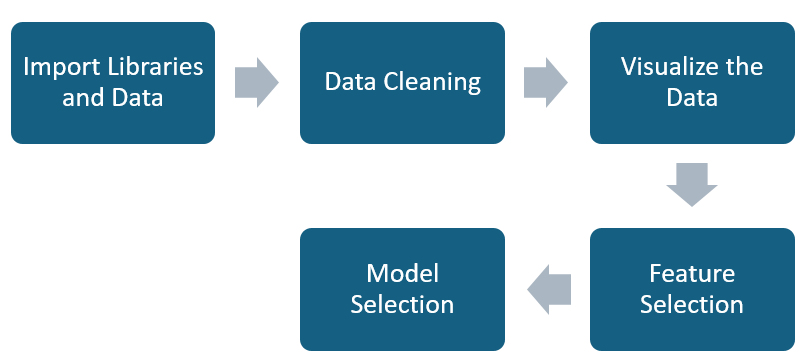

### Importing Libraries and Dataset

The first step is to import the necessary Python libraries, such as NumPy, Pandas, Matplotlib, and Scikit-learn, which will be used for data manipulation, visualization, and modeling.
The dataset containing the relevant features and the target variable (heart attack risk) will also be imported into the project.

### Data Cleaning

The dataset may contain missing values, outliers, or inconsistencies that need to be addressed.
The data cleaning process involves identifying and handling these issues, such as filling in missing values, removing outliers, and ensuring data integrity.

### Data Visualization

Exploratory data analysis is performed using various visualization techniques, such as scatter plots, histograms, and correlation matrices.
These visualizations help to understand the relationships between the features and the target variable, as well as identify any potential patterns or trends in the data.

### Feature Selection

Based on the insights gained from the data visualization, the most relevant features that are likely to influence the risk of a heart attack are selected.
Techniques like correlation analysis and feature importance, are used to identify the most informative features.

### Model Selection

After selecting the relevant features, various machine learning models are evaluated to determine the best-performing model for predicting heart attack risk.
Models used for this task include logistic regression, decision trees, random forests, and support vector machines.
The performance of these models is assessed using appropriate evaluation metrics, such as accuracy, precision, recall, and F1-score.

### Model Optimization

The selected model may be further optimized by tuning its hyperparameters, such as the regularization strength or the number of trees in a random forest.
This step aims to improve the model's performance and generalization capabilities.

### Model Evaluation and Deployment

The final model is evaluated on a held-out test set to assess its performance on unseen data.
Once the model is deemed satisfactory, it can be deployed to make predictions on new data and assist healthcare professionals in identifying individuals at high risk of heart attacks.

# Dataset description

The dataset is composed of 8763 observations. There are 24 independent variables and 1 dependent variable. Among 24 independent variables, there are 11 quantitative variables: age, cholesterol, blood pressure, heart rate, exercise hours per week, sedentary hours per day, income, BMI, triglyceride, physical activity days per week, sleep hours per day, and 13 categorical variables: sex, diabetes, family history, smoking, obesity, alcohol consumption, previous heart problems, medication use, country, continent, hemisphere, stress level, diet.

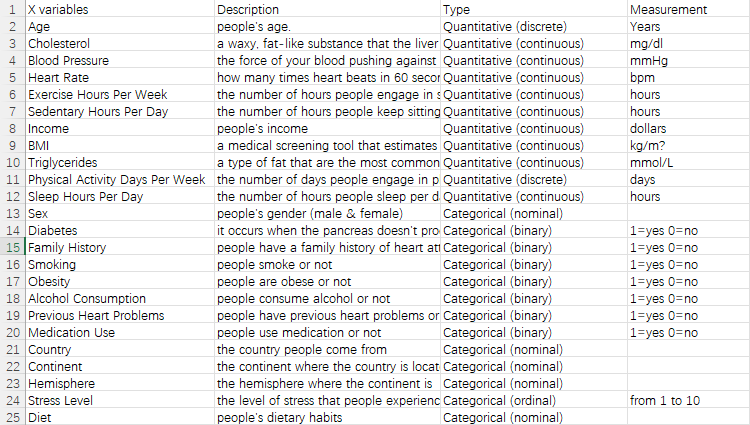

# Data Cleaning

The necessary libraries for data manipulation, visualization, and machine learning were imported. The dataset, 'heart_attack_prediction_dataset.csv', was read into a DataFrame using pandas.

Firstly, we check the data shape, null values, and duplicates in the dataset, and then drop the ‘Patient ID’ as it indicates nothing and does not contribute to the prediction. Secondly, we map and convert variables from numerical to categorical (0-Low, 1-High). Finally, we split the column ‘blood pressure’ into two variables, 'Systolic_BP' and 'Diastolic_BP' for more granular analysis and converted to integers.

# Data Visualization

## Distribution of Heart Attack Risk

The bar chart was used to display the distribution of heart risk count. As indicated above, Low indicates 0, which means no heart attack risk, while High indicates 1, which means heart attack risk.

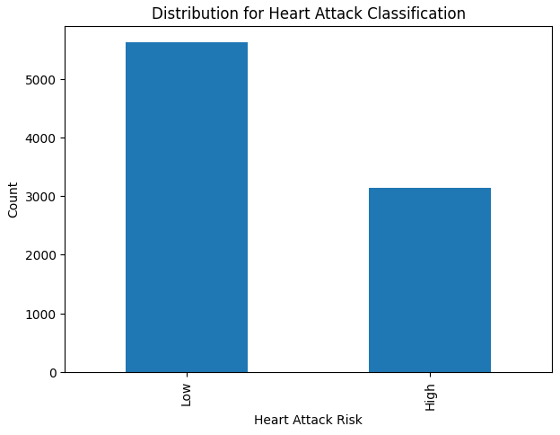

## Distribution of Categorical Variables

Histograms for each categorical variable were plotted with respect to 'Heart Attack Risk' to observe their distribution.
Heart Attack Risk distribution by sex.

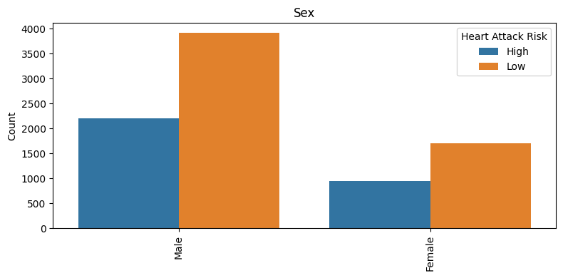

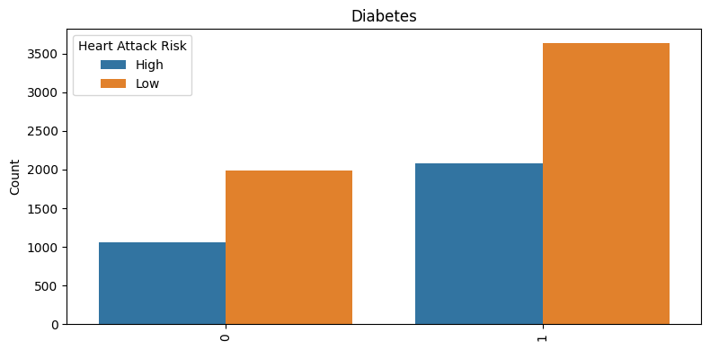

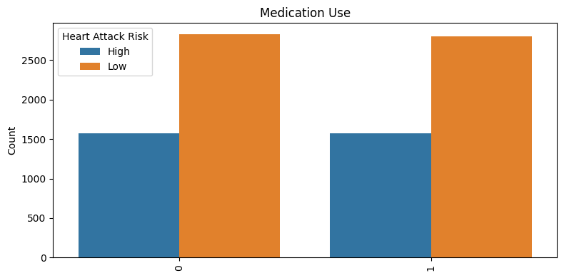

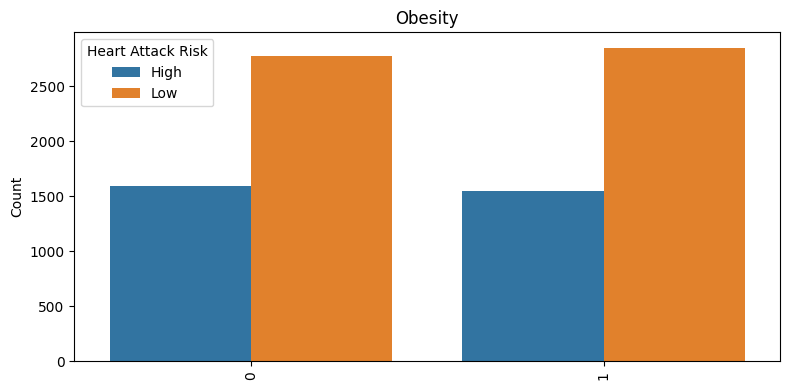

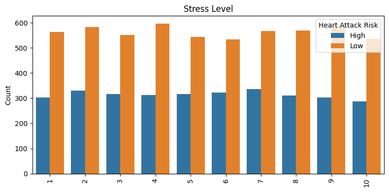

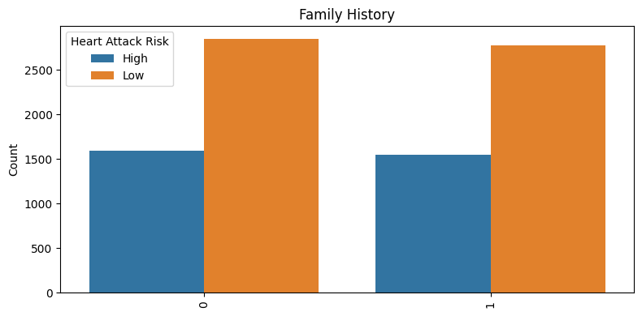

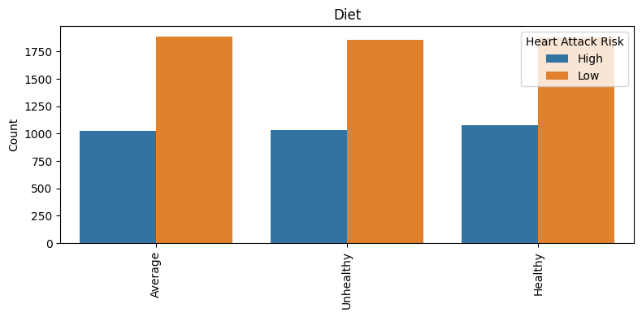

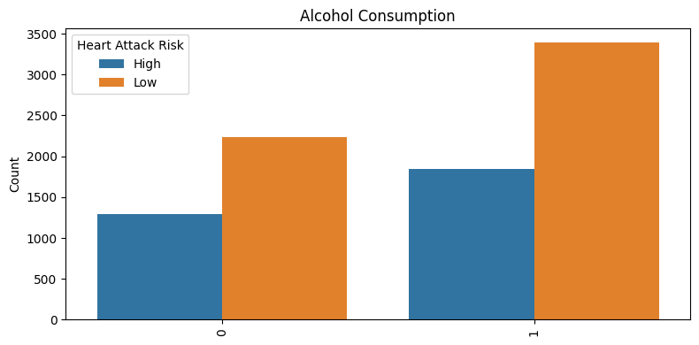

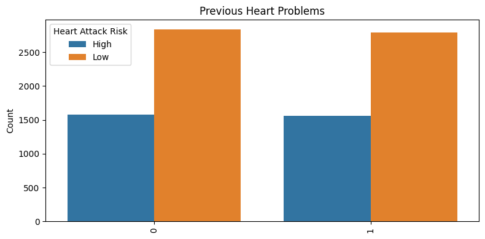

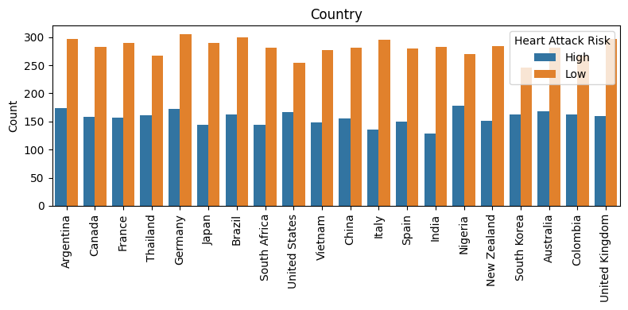

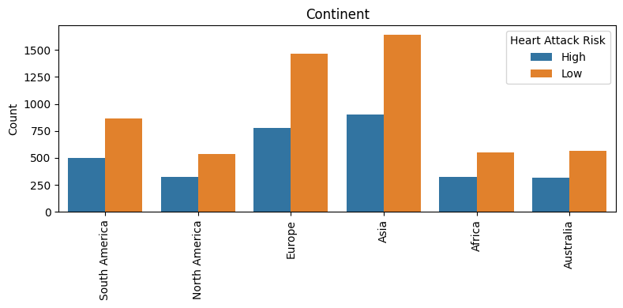

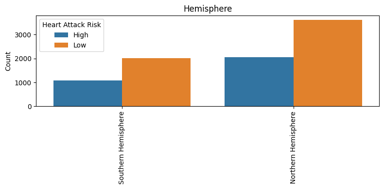

## Distribution of Numerical Variables

Box plots for each numerical variable were plotted with respect to 'Heart Attack Risk' to observe their distribution. We also split the column ‘blood pressure’ into ‘Systolic_BP’ and ‘Diastolic_BP’.

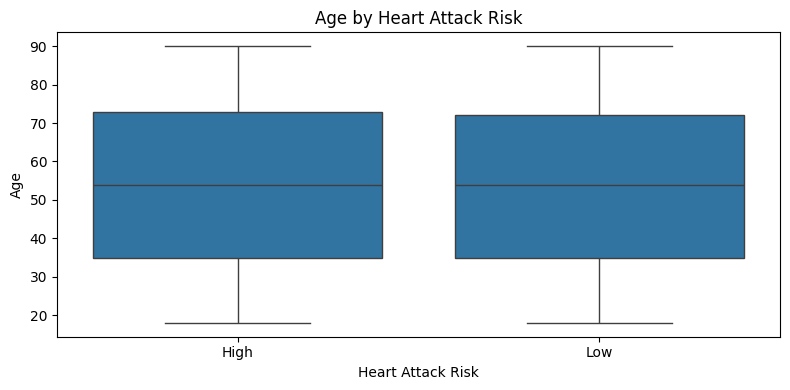

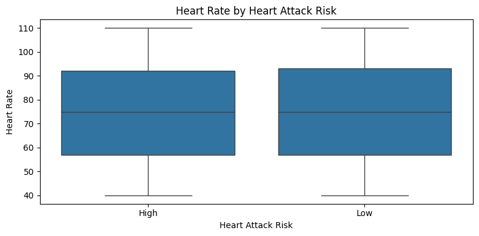

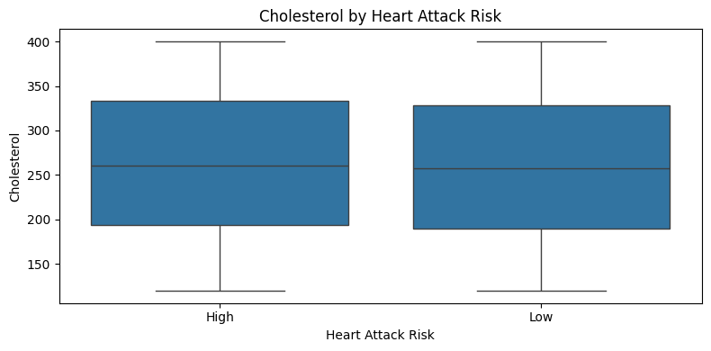

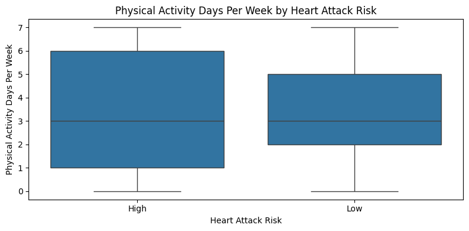

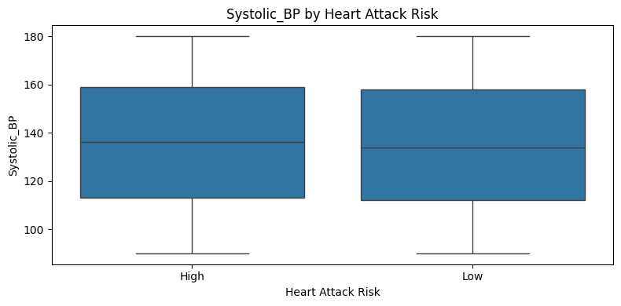

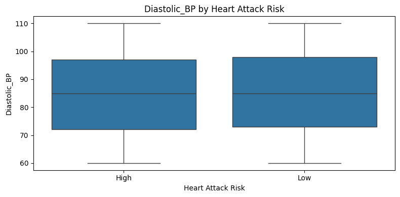

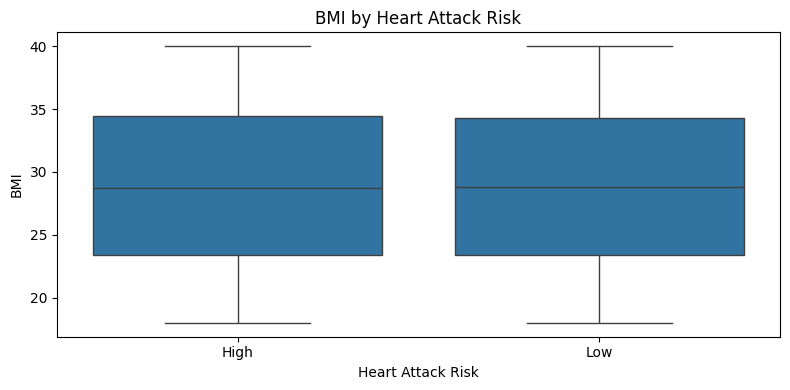

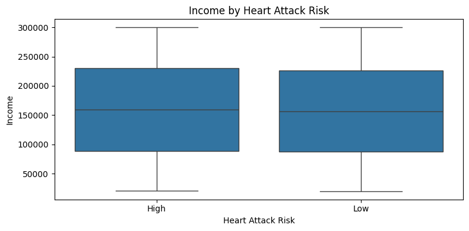

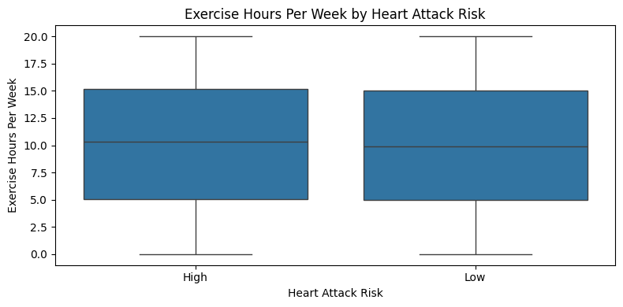

# Exploratory Data Analysis

##  Chi-Squared Test on Categorical Variables

The chi-squared test is a statistical test used to determine whether there is a significant relationship between two categorical variables. The test is performed to assess whether the categorical variables are significantly associated with the target or outcome variable.

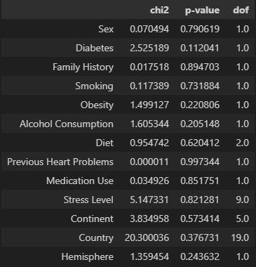

The results show the chi-squared statistic (chi2) and the corresponding p-value (p-value) for each categorical variable. The p-value represents the probability of obtaining the observed test statistic (or a more extreme value) under the null hypothesis, which assumes that there is no significant relationship between the categorical variable and the target variable.

All the p-values are more than the commonly used significance level of 0.05 (or 5%). This indicates we fail to reject the null hypothesis, and there is little statistical significant relationship between these categorical variables and the target variable. The "dof" column represents the degrees of freedom for the chi-squared test, which is typically one less than the number of categories for each variable.

In summary, the results of the chi-squared test suggest that most of the categorical variables are insignificantly associated with the target variable. This information was useful for feature selection and futher analysis.

## Correlation 

A correlation matrix is a square matrix that shows the pairwise correlation coefficients between each pair of numerical variables in the dataset. The correlation coefficient ranges from -1 to 1, where -1 indicates a strong negative correlation, 0 indicates no correlation, and 1 indicates a strong positive correlation.

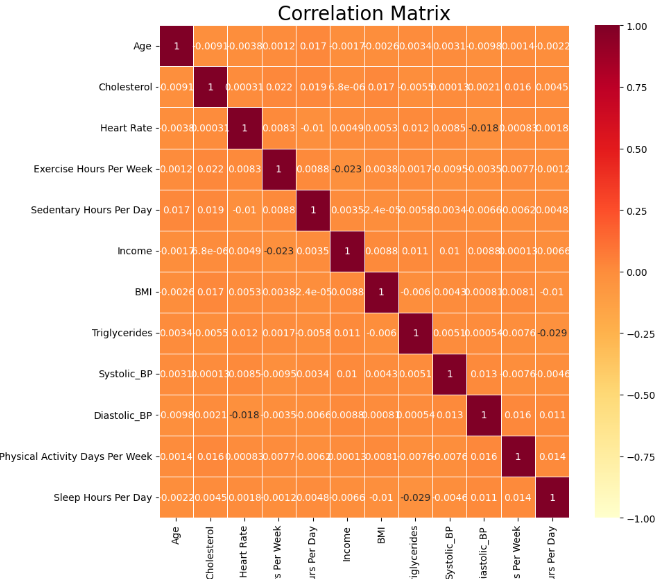

The correlation matrix provides a visual representation of the strength and direction of the relationships between these numerical variables. Each cell in the matrix represents the correlation coefficient between the corresponding variables.

The diagonal elements (where the row and column variables are the same) are all 1.0, as a variable is perfectly correlated with itself.
The color coding in the matrix helps to quickly identify the strength and direction of the correlations. The darker the red color, the stronger the positive correlation, while the lighter the yellow color, the stronger the negative correlation.

By analyzing the correlation matrix, the valuable insights into the relationships between the numerical variables in the dataset is that there exists no significant multi-correlations. This information was used to inform feature selection.

